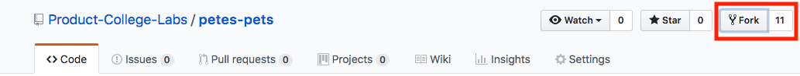

This tutorial will walk you through adding the most common advanced features to an Express.js server.

# Learning Outcomes

By the end of this tutorial, you should be able to add the following features to an Express.js server:

 * Simple Search
 * Pagination
 * Adding Validations
 * Error and success messages
 * Uploading images and files
 * Adding payment gateways like Stripe
 * Sending emails
 * Respond to JSON

### Outside In Philosophy & Vaporware

We're going to build this whole app from the outside-in, meaning each step, we're always going to build what the user sees (the **views** or **templates**) first. We can even populate these with some mock data using arrays. This first step is called building **Vaporware** and is an excellent pattern that will save you time and improve your client and stakeholder happiness.

> [info]
**Vaporware** is when you build out the templates with mock data, and it is a fantastic pattern to build navigable mock ups for clients and stakeholders before committing to building the logic and database relationships.

# Commits with Git

As you go through this tutorial, you will also be making commits after completing milestones. **This is a requirement, you must make a commit whenever the tutorial prompts you**. This not only further enforces best practices for software engineering, but also will help you more easily figure out where a bug originated from if you break your progress up into discrete, trackable chunks.

When prompted to commit, you'll see a sample commit message. Feel free to use your own message, so long as it clearly and concisely covers the work done.

Lastly, the commit prompts in this tutorial should be the **minimum** amount of times you commit. If you want to do more commits, breaking your chunks into even smaller chunks, that is totally fine!

# Getting Started - Forking/Cloning the Starter Project

You won't always be starting with a **Green Field Project** - a project where you start from scratch - sometimes you'll work on a project that has already started. In this tutorial we'll simulate that by starting with a relatively simple starter project.

>[action]
> Go to the [starter repo](https://github.com/Product-College-Labs/petes-pets) and **fork** the repo into your own personal account
> 

Doing this will allow you to commit/push/pull the changes you make to your own account. **It is very important you do the above step first before doing the below**.

Once you have **forked** the repo, continue on to the next steps:

> [action]
> Clone the starter project from your fork
>
```bash
git clone [URL to your starter repo] petes-pets-tutorial
cd petes-pets-tutorial
npm install
```

Now there is just one more step to seed your database before running your server.

> [action]
> Install `node-mongo-seeds`
>
```bash
$ npm install -g node-mongo-seeds
$ seed
$ nodemon
```

Now your browser at `localhost:3000` should look like this:


You can also run `$ mocha` and see the tests run. They should all pass!

# Reading the Code Base

If you try to navigate around, you'll find that the behavior is kind of funky. You can create new pets and view them, but what if you try to edit a pet? Everything is back to the way it was before.

To understand what is going on, let's do what we have to do every time we start with a new code base. We have to *READ IT*.

Start by looking through all the code starting with the `server.js` file.

Here are some characteristics of this project:

* *1 Resource* - How many resources are there in this application? What are they? - There is 1 resource: Pets
* *Pug* - This project uses the templating engine called [Pug](https://pugjs.org/api/getting-started.html). Pug is an *HTML preprocessor* that simplifies HTML into a python-like syntax. Watch out for indentation!
* *Seeding the DB* - The `seeds` folder contains files that we can use to seed the database.
* `/bin/www` - notice that the server runs out of the `bin/www` file. Weird! But actually a common convention. We are pulling the concern of starting the server (`app.listen()`) into its own file (just like we pulled out routes, models, and views).

What other characteristics can you find?

> [action]
> Before moving on complete the following:
> Are there any middleware that you do not recognize in `server.js`? Google them and comment your code with what they do.

Before we move on, let's make our first commit:

>[action]
>
```bash
$ git add .
$ git commit -m 'cloned starter and added comments'
$ git push origin master -u
```
