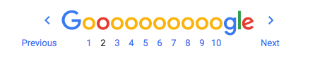

One of the simplest ways to speed up a website is to use **Pagination**. Pagination just means "to add pages" to something.

You have seen this before because Google has a very recognizable pagination system:



# Make a Plan

Once again - no matter how small the feature is, it's always good to write out the steps you plan to take to implement a feature.

Let's code from the **Outside-In**, so we'll start with the views, then do the controllers, and finally use or extend the models and database.

1. We are going to add pagination to the `/` and `/search` routes first and those both use the `pets-index.pug` template, so we can use bootstrap's pagination snippet to start that.
1. Next we need to add the `mongoose-paginate` module  to extend Mongoose with pagination methods to only return pages of 10 pets.
1. Finally we need to write a test for both routes so that we can ship it!


# Pagination Navigation Snippet

>[action]
> Let's add this `nav` snippet to the bottom of the `pets-index.pug` template.
>
```pug
block content
    .row
...
    nav(aria-label='Page navigation example').d-flex.justify-content-center
      ul.pagination
        li.page-item
          a.page-link(href='#') Previous
        li.page-item
          a.page-link(href='#') 1
        li.page-item
          a.page-link(href='#') 2
        li.page-item
          a.page-link(href='#') 3
        li.page-item
          a.page-link(href='#') Next
```

It doesn't do much right now... its totally static! We'll have to do some work to make it respond intelligently to the number of pet records we have. For example, if there are 35 records, there should be 4 pages, (at most 10 per page, 5 on the fourth page).

# Pagination Module

Mongoose does not ship with pagination supported, but we can add it using the `mongoose-paginate` module because [edwardhotchkiss](https://github.com/edwardhotchkiss/mongoose-paginate) made it!

>[action]
> Add the `mongoose-paginate` module
>
```bash
npm install mongoose-paginate --save
```
>
> Now initialize it, set its defaults options, and add it as a plugin for `/models/pet.js`:
>
```js
// pet.js
...
>
const mongoosePaginate = require('mongoose-paginate');
>
mongoosePaginate.paginate.options = {
  limit: 3 // how many records on each page
};
>
const PetSchema = new Schema({
  ...
})
>
...
>
PetSchema.plugin(mongoosePaginate);
>
module.exports = mongoose.model('Pet', PetSchema);
```

To do a smoke test of this working let's use the new `.paginate()` function on our model in the `/` route query.

>[action]
> Update `/routes/index/get` in `index.js` to be the following:
>
```js
//index.js
>
/* GET home page. */
app.get('/', (req, res) => {
  Pet.paginate().then((results) => {
    res.render('pets-index', { pets: results.docs });    
  });
});
```

Mongoose-paginate returns only a `results` variable that has these properties:

```js
result.docs // the array of records on the current page
result.total // the total number of records
result.limit // the limit
result.page // the current page
result.pages // the total number of pages
```

The `docs` node is our array that will contain our Pets that we'll display:

```
{ docs:
  [ { _id: 5b0dc8a131fcd81863b9693c,
      id: 0,
      name: 'Rex',
      species: 'Rottweiler',
      birthday: '20017-11-11',
      favoriteFood: 'Chicken',
      picUrl: 'ht
      ...
```

So we have to update our response to access the `docs` node of this JSON and return that array as `pets` to our template.

# Page Parameter

So how do we move from page to page? Well if you have used pagination on a few websites, you'll notice that the url is updated based on what page you are on:

```
Yelp calls it "start"
https://www.yelp.com/search?find_loc=San+Francisco%2C+CA&start=20

Reddit calls it "count"
https://www.reddit.com/?count=25&after=t3_8qkf60
```

We're going to call it `page`.

```
http://localhost:3000/
http://localhost:3000/?page=3
http://localhost:3000/?page=2
```

>[action]
> Update `/routes/index/get` in `index.js` to be the following:
>
```js
/* GET home page. */
app.get('/', (req, res) => {
  const page = req.query.page || 1
>
  Pet.paginate({}, {page: page}).then((results) => {
    res.render('pets-index', { pets: results.docs });    
  });
});
```

Notice that we're using the `||` or `or` operator to make sure there is always a value for `page`. In JavaScript and some other languages, the `||` operator will evaluate to it's "truthy" value, meaning if `req.query.page` is `null` or `undefined`, `page` will be equal to `1`.

Test out if the above `localhost` urls are working.

# Pagination Navigation Snippet (Part Deux)

So back to our pagination snippet. We can successfully navigate to the different pages, but only if we know the URL. We gotta make our navigation snippet work so that it behaves like the Gooooooogle one.

Remember that a `mongoose-paginate` query returns these elements:

```js
result.docs // the array of records on the current page
result.total // the total number of records
result.limit // the limit
result.page // the current page
result.pages // the total number of pages
```

Let's use this in the template to make our pagination snippet dynamically respond to however many records we have. We're going to use `results.pages` and rename it `pagesCount` because that is a more accurate naming convention because now we know it is an integer.

> [action]
> Update the `res.render` line from `/routes/index/get` in `index.js` to include `pagesCount`:
>
```js
res.render('pets-index', { pets: results.docs, pagesCount: results.pages });
```

Now we need to use pug's built in `while` iterator to loop over the `pagesCount` variable to make a number for each of our pages.

> [action]
> Update your `nav` component in `/views/pets-index.pug` to the following:
>
```pug
nav(aria-label='Page navigation example').d-flex.justify-content-center
  ul.pagination
    li.page-item
      a.page-link(href='#') Previous
>
    - var i = 1;
    while i <= pagesCount
      li.page-item
        a.page-link(href=`?pages=${i}`)= i++
>
    li.page-item
      a.page-link(href='#') Next
```

# Next & Previous Buttons

Finally we need to make the Next and Previous buttons work. For that we will add `currentPage` to the template. We'll use the `currentPage` to do some math to derive the previous and the next button, and to hide them if they are not necessary, like on the first and last pages.

> [action]
> Update the `res.render` line from `/routes/index/get` in `index.js` to include `currentPage`:
>
```js
/* GET home page. */
res.render('pets-index', { pets: results.docs, pagesCount: results.pages, currentPage: page });
```

Now we can use `currentPage` to move forward and backwards from this page. One snafu is that `currentPage` becomes a string when it is rendered here, so we have to use the `parseInt()` function in JavaScript to parse the string back into an integer to do math with it.

> [action]
> Update your `nav` component in `/views/pets-index.pug` to the following:
>
```pug
nav(aria-label='Page navigation example').d-flex.justify-content-center
  ul.pagination
    if currentPage > 1
      li.page-item
        a.page-link(href=`?page=${currentPage - 1}`) Previous
>
    - var i = 1;
    while i <= pagesCount
      li.page-item
        a.page-link(href=`?page=${i}`)= i++
>
    if currentPage < pagesCount
      li.page-item
        a.page-link(href=`?page=${parseInt(currentPage) + 1}`) Next
```

See if your pagination works!

# Now Commit

```bash
git add .
git commit -m 'Implemented pagination on the home page'
git push
```

# Paginate Search

Now can you make sure that the `/search` results are also paginated?

Once you have those paginated, move on to the next chapter (but not before you do one more **Commit** for your paginated search!).
