1. ~~Implement simple search on the store~~
1. ~~Build out pagination~~
1. ~~Implement validations, success, and error handling~~
1. **Uploading files**
    1. **Get an AWS console account**
    1. **Get our API public and secret keys and save them in our `.env` folder.**
    1. **Make a new "bucket" in AWS S3**
    1. **Change the form to use `multipart/form-data`**
    1. **Add some middleware to accept `multipart/form-data`: `multer`**
    1. **Add some middleware to interact with the S3 API: `s3-uploader`**
    1. **Initialize and use the middleware in the controller route.**
    1. **Save the image URL into the database**
    1. **Display the image using the URL**
1. Integrating payment gateways
1. Sending emails
1. Building Full-text Search
1. Responding to JSON

Uploading files and especially images is a very common pattern, but it is not that simple. Since Heroku and many server solutions do not allow you to store a lot of data in them, we need to use a third party service to save off any files or images we want to have access to later.

We'll be using **Amazon Web Services Simple Storage Service (AWS S3)** to save our images and files. This service's API will give us a unique URI we can use to retrieve the files later when we want to display them or download them.

# Make a Plan

In order to accomplish this pattern we have to take the following steps:

1. Get an AWS console account
1. Get our API public and secret keys and save them in our `.env` folder.
1. Make a new "bucket" in AWS S3
1. Change the form to use `multipart/form-data`
1. Add some middleware to accept `multipart/form-data`: `multer`
1. Add some middleware to interact with the S3 API: `s3-uploader`
1. Initialize and use the middleware in the controller route.
1. Save the image URL into the database
1. Display the image using the URL

# Disclaimer

Amazon tends to update how their process on getting an AWS console account/creating S3 buckets fairly regularly. **As of 1/22/19, the below information is correct, but is subject to change.**

Please reference the [AWS Documentation](https://docs.aws.amazon.com/index.html#lang/en_us) if you run into any trouble. Also please notify your instructor if anything is outdated or needs tweaking here.

# Get an AWS Console Account

1. [Sign up for an AWS console account](https://aws.amazon.com/console/) by navigating to the link and clicking the **Create a Free Account** button.
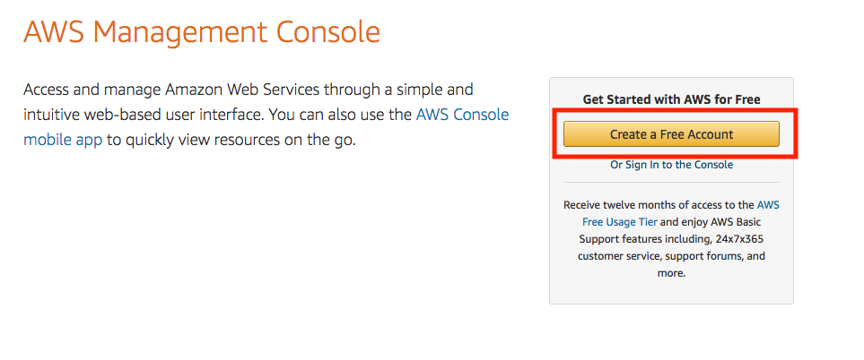
1. Fill out the account information form and then press **Continue**
1. On the *Contact Information* page, select `Personal` when asked for account type and fill out the required information.
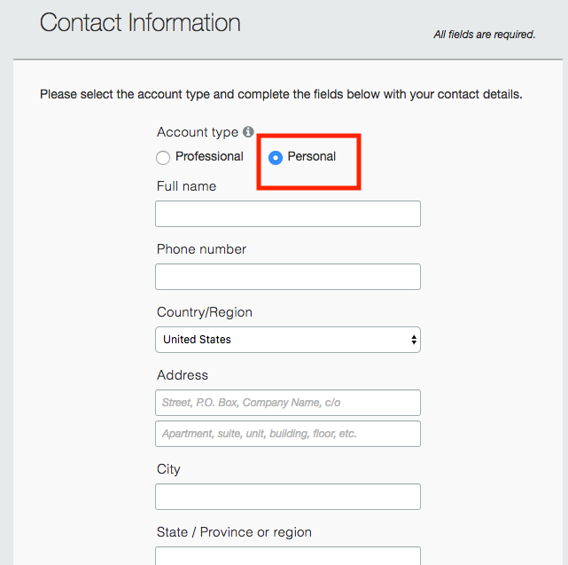
1. Enter your credit card information. **Don't worry, you won't be charged as long as you don't exceed the [AWS Free Tier Limits](https://aws.amazon.com/free/) (which you shouldn't, since this is just a small, non-public web app)**
1. Fill out the `Confirm your identity` form
1. After confirming your account, make sure to select the **Basic Plan**, which is the **Free** one. **If you don't choose Basic, your credit card you submitted will be charged**.
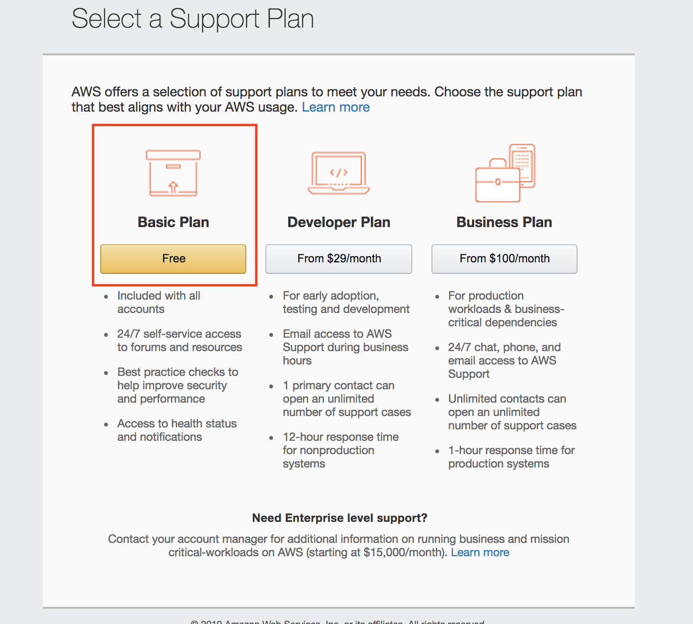
1. Finally, on the confirmation page, click the **Sign into Console** button, and put in your email/password that you just created. You should see this screen once you're signed in:


# Get our Access Key ID and Secret access keys

1. Once you're signed in, under the **Find Services** searchbar, search for **IAM** and select the service.
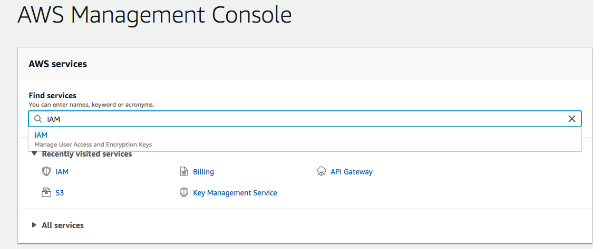
1. Select **Users** from the sidebar
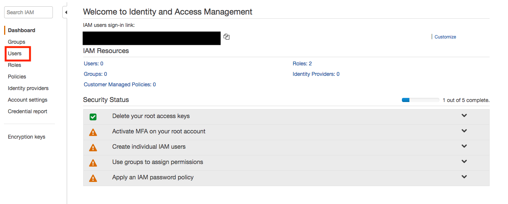
1. In the top left, select **Add user**
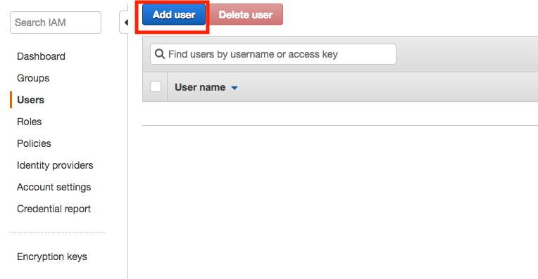
1. Give `petepet` as the **User name**, and  under **Access Type** Select the **Programmatic access**. From there click the **Next:Permissions** button
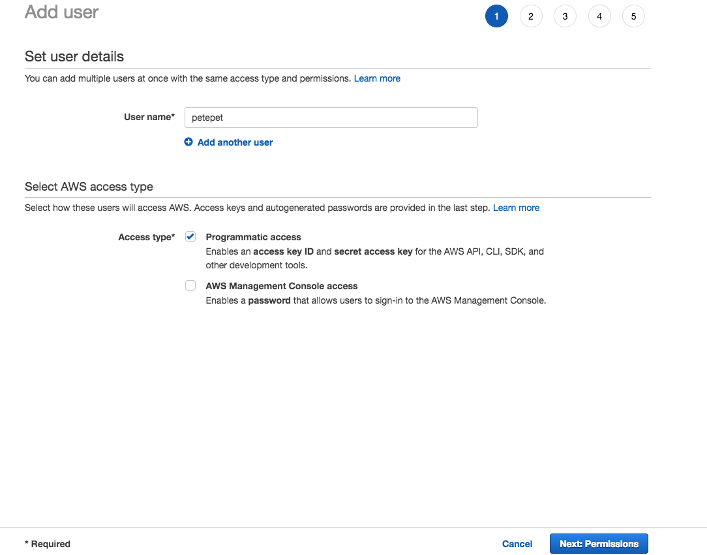
1. On the following page, make sure **Attach exisiting policies directly** is selected and then search for `AmazonS3FullAccess`. Check the box next to the `AmazonS3FullAccess`, then select **Next:Tags**
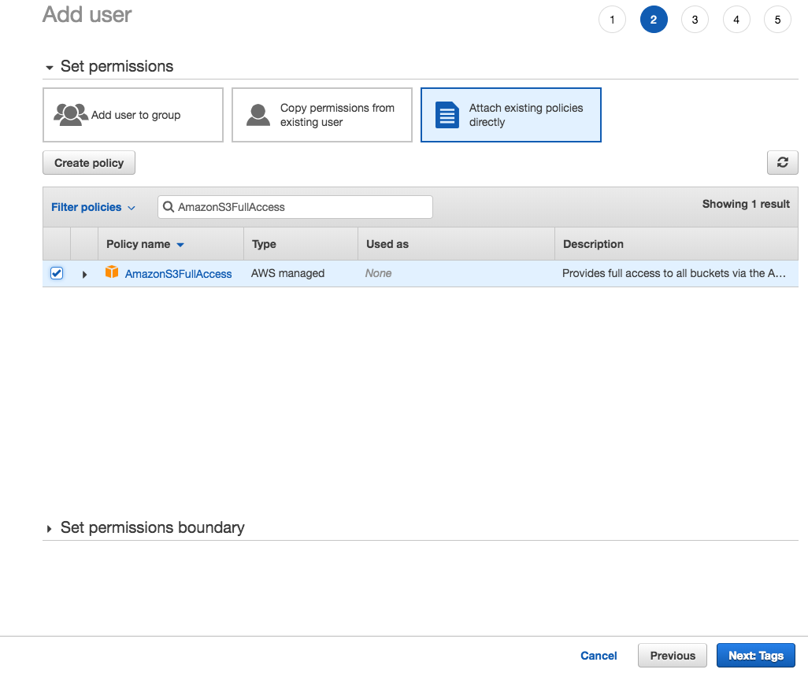
1. Skip the tags (we won't need it) and just select **Next: Review**
1. Make sure everything looks correct, and then select **Create User**


You should now have a user that has both an **Access Key ID** and a **Secret access key**.

>[action]
> In your project folder, create a `.env` file. Then copy the **Access Key ID** and **Secret access key** values into the file in this format, replacing `ACCESSKEYID` and `SecRETAcCeSskEY` with your user's values:
>
```
AWS_ACCESS_KEY_ID=ACCESSKEYID
AWS_SECRET_ACCESS_KEY=SecRETAcCeSskEY
```

Once you're done with this, go back to your browser and select **Close** on the Success screen.

## Backup Plan for Access Keys
If for whatever reason those keys don't work, you can try making a key for your AWS root account instead. Follow these steps as a backup plan:

1. From the home screen, select **Activate MFA on your root account** and then press **Manage MFA**
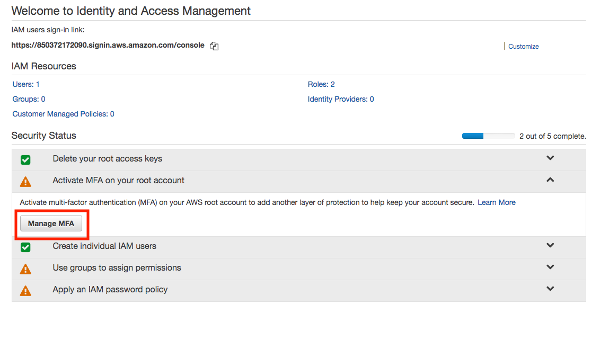
1. On the popup, check the checkbox and then choose **Continue to Security Credentials**

1. Select **Access keys (access key ID and secret access key)** and click the **Create New Access Key** button. Again noting this isn't the ideal way to do it, but it is a backup plan
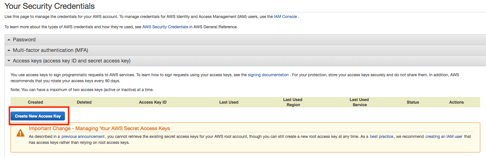
1. Click on **Show Access Key** in the popup
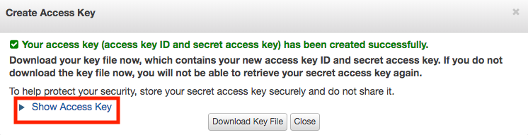

You should now have the root **Access Key ID** and a **Secret access key**. Try using those in your `.env` file if your user ones don't work.

# Make a new "bucket" in AWS S3

1. Start by navigating [back to your console](https://console.aws.amazon.com/s3/), and choose **Create bucket**
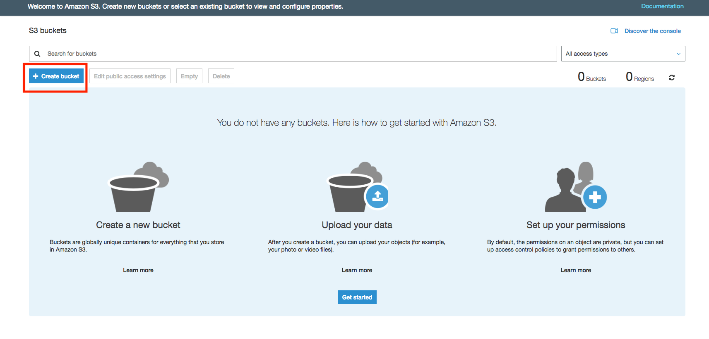
1. Provide a **unique bucket name**, and under **Region**, select `US West (N. California)`. From there hit **Next**
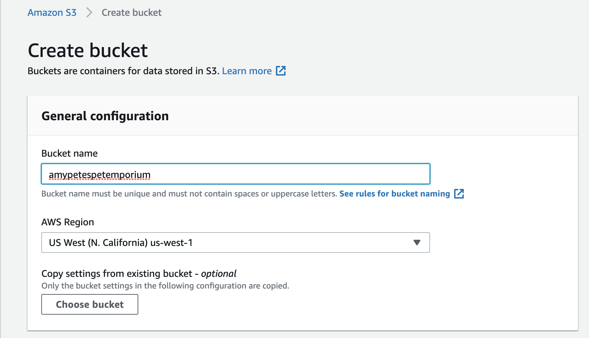
1. On the **Properties** screen, don't select any of the options and just press **Next**. More info on the properties can be found [here](https://docs.aws.amazon.com/AmazonS3/latest/user-guide/create-bucket.html)
1. *Uncheck* all settings on the **Public access settings for this bucket** page and press **Next**
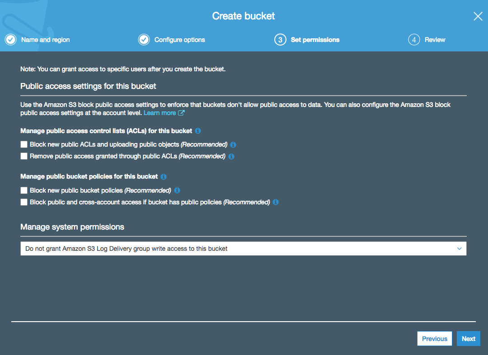
1. Review your bucket, making sure the **Region** is set to `US West (N. California)`, and then select **Create bucket**
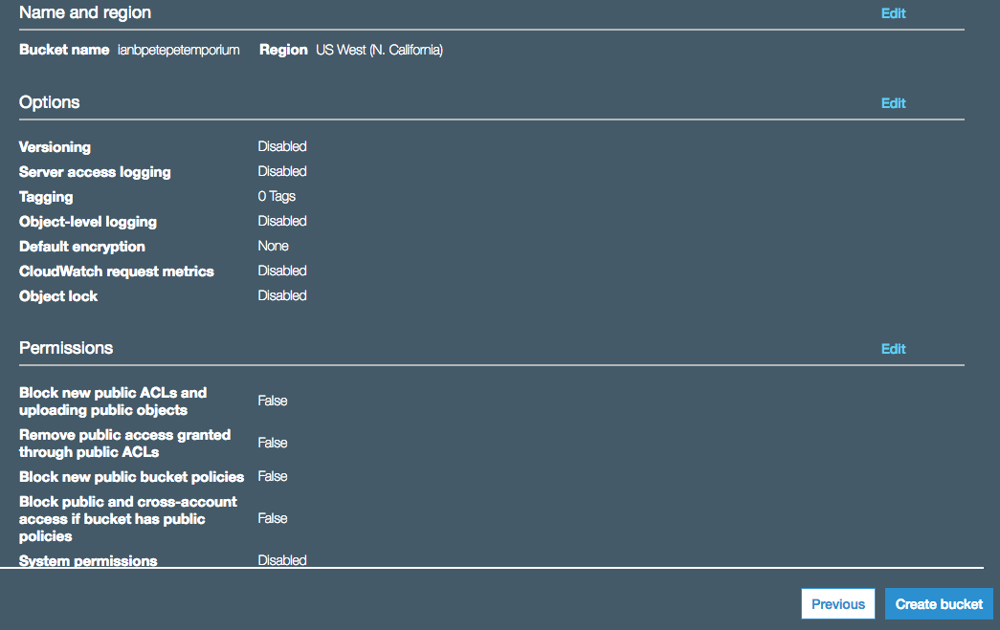
1. Select your newly created bucket and navigate to the **Permissions** tab. Click on **Bucket Policy** and paste in the following policy. Once you've done that, press **Save**:

```json
{
    "Version": "2012-10-17",
    "Statement": [
        {
            "Sid": "PublicReadGetObject",
            "Effect": "Allow",
            "Principal": "*",
            "Action": "s3:GetObject",
            "Resource": "arn:aws:s3:::[YOUR_BUCKET_NAME]/*"
        }
    ]
}
```
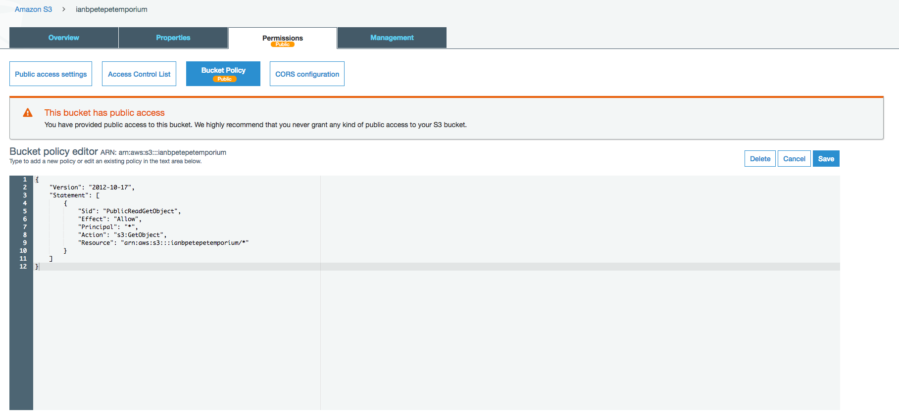

Finally, make sure to add the **region** and **bucket** to your `.env` file.

>[action]
> Add the following to lines to your `.env` file:
>
```
S3_REGION=us-west-1
S3_BUCKET=[YOUR_BUCKET_NAME]
```

Alright! We're all set up with AWS now!

# Adding Middleware: s3-uploader

Now that we are submitting multipart/form-data we need to parse it using `multer` and then interact with the AWS api using `s3-uploader`. [s3-uploader docs](https://www.npmjs.com/package/s3-uploader). This is also going to require the use of [Imagemagick](https://www.imagemagick.org/) in order to manipulate images.

>[action]
> Let's install the middleware:
>
```bash
$ brew install imagemagick
$ npm install multer s3-uploader --save
```

Now let's load our modules, but not in `server.js` because we don't need it for the whole app, just in the specific route. So we'll load them right in the controller where we'll use it: `pets.js`.

>[action]
> Update `/routes/pets.js` to include the new modules:
>
```js
...
// UPLOADING TO AWS S3
const multer  = require('multer');
const upload = multer({ dest: 'uploads/' });
const Upload = require('s3-uploader');
...
```

Now we need to initialize and configure the `s3-uploader` object.

We want the configuration settings to:
1. Set the path in AWS to the bucket and with the access keys.
1. Clean up - when the upload is complete, we want to delete the originals and caches.
1. We want two versions: one a rectangle and one a square, neither wider than 300-400px.

> [action]
> Add `client` right underneath the modules you just added in `/routes/pets.js`:
>
```js
const client = new Upload(process.env.S3_BUCKET, {
  aws: {
    path: 'pets/avatar',
    region: process.env.S3_REGION,
    acl: 'public-read',
    accessKeyId: process.env.AWS_ACCESS_KEY_ID,
    secretAccessKey: process.env.AWS_SECRET_ACCESS_KEY
  },
  cleanup: {
    versions: true,
    original: true
  },
  versions: [{
    maxWidth: 400,
    aspect: '16:10',
    suffix: '-standard'
  },{
    maxWidth: 300,
    aspect: '1:1',
    suffix: '-square'
  }]
});
```

Alright, middleware added! Now let's do something with it

# Updating the controller

We're already in it, so let's finish updating the controller. We have to make some changes to our `POST` route to use `multer` and this `client` object we've just initialized and configured.

>[action]
>
First we have to add `upload.single('avatar')` to the `create` route in `/routes/pets.js`:
>
```js
// CREATE PET
app.post('/pets', upload.single('avatar'), (req, res, next) => {
  console.log(req.file)
  ...
})
```

Once `req.file` is defined and coming in from our file input field from our form, we need to use `client` to save `req.file` to AWS and get back the URL our S3 bucket for the image.

After the pet is successfully saved, then we can save the image. We're going to get back both the version URL's but we just want the URL leaving off the `-standard` and `-square` because we can then save just one URL and when we call it. We'll make sure the views can handle this in a sec.

>[action]
> Update the body of the `create` route in `/routes/pets.js` with the following:
>
```js
// CREATE PET
  app.post('/pets', upload.single('avatar'), (req, res, next) => {
    var pet = new Pet(req.body);
    pet.save(function (err) {
      if (req.file) {
        client.upload(req.file.path, {}, function (err, versions, meta) {
          if (err) { return res.status(400).send({ err: err }) };
>
          versions.forEach(function (image) {
            var urlArray = image.url.split('-');
            urlArray.pop();
            var url = urlArray.join('-');
            pet.avatarUrl = url;
            pet.save();
          });
>
          res.send({ pet: pet });
        });
      } else {
        res.send({ pet: pet });
      }
    })
  })
```

This won't work yet, as we have to update the model and the views, but before we move on to those, we also need to make sure that we update `public/javascripts/scripts.js` to handle files.

# Update the Scripts

 We need to update `public/javascripts/scripts.js` to handle files by utilizing [FormData](https://developer.mozilla.org/en-US/docs/Web/API/FormData) to properly send the file with our text, as well as adjusting the headers in `axio`.

>[action]
> Open `public/javascripts/scripts.js` and change the script in there to the following:
>
```js
if (document.querySelector('#new-pet')) {
    document.querySelector('#new-pet').addEventListener('submit', (e) => {
        e.preventDefault();
        // Use FormData to grab everything now that we have files mixed in with text
        var form = document.getElementById("new-pet");
        var pet = new FormData(form);
>
        // Assign the multipart/form-data headers to axios does a proper post
        axios.post('/pets', pet, {
            headers: {
                'Content-Type': 'multipart/form-data;',
            }
        })
            .then(function (response) {
                window.location.replace(`/pets/${response.data.pet._id}`);
            })
            .catch(function (error) {
                const alert = document.getElementById('alert')
                alert.classList.add('alert-warning');
                alert.textContent = 'Oops, something went wrong saving your pet. Please check your information and try again.';
                alert.style.display = 'block';
                setTimeout(() => {
                    alert.style.display = 'none';
                    alert.classList.remove('alert-warning');
                }, 3000)
            });
    });
}
```

Alright! Let's move on to the model.

# Updating the Model

Back in our controller, we were calling `pet.avatarUrl`, but we never made that a part of our model! We also can't get rid of our previous URL parameters, as we want our old code to still work. Let's fix that:

>[action]
> Update the schema in `/models/pet.js` to include `avatarUrl`, and drop the `required` from `picUrl` and `picUrlSq`
>
```js
const PetSchema = new Schema({
  name: { type: String, required: true }
  , birthday: {type: String, required: true }
  , species: { type: String, required: true }
  , picUrl: { type: String }
  , picUrlSq: { type: String }
  , avatarUrl: { type: String, required: true }
  , favoriteFood: { type: String, required: true }
  , description: { type: String, minlength: 140, required: true }
})
```

Almost there, let's wrap this up with our views!

# Displaying the Image

Alright, our model and controller are set, now we just gotta make the images show up!

First let's change our New Pet form to actually allow for giving a file for the `avatar` instead of providing two image URLs.

>[action]
> Replace the `picUrl` and `picUrlSq` `.form-group` elements with one for `avatar`:
>
```pug
.form-group
  label Avatar*
  input.form-control(name="avatar" type="file" required)
```

Next we want to make sure that the images on both our `index` and `show` views appear properly not only for `avatarUrl`, but for our original image url parameters as well (otherwise all those original pets won't have an image!)

>[action]
> Update the `img` element in `/views/pets-index.pug` with the following conditional:
>
```pug
...
if pet.avatarUrl
  img.card-img-top(src=pet.avatarUrl + '-standard.', alt='Card image cap')
else
  img.card-img-top(src=pet.picUrl, alt='Card image cap')
...
```
>
> Make sure to do the same (but with "square") for `/views/pets-show.pug`:
>
```pug
...
if pet.avatarUrl
  img.card-img-top(src=pet.avatarUrl + '-square.', alt='Card image cap')
else
  img.card-img-top(src=pet.picUrlSq, alt='Card image cap')
...
```

**One important note**: in the above code snippets, notice the periods (`.`) after both `standard` and `square`. It's important to include that so that the image will *actually download* from the server and display. Otherwise you'll get a broken image!


# Product So Far

Try uploading a new pet using an avatar! Make sure your old pets all still display too.

You should notice that an `uploads/` folder gets created. **Make sure to add `uploads` to your `.gitignore` file so you don't push up all your uploaded images to GitHub.**

Congrats on getting AWS S3 up and running with your code! That's no small feat. Let's commit this!

# Now Commit

```bash
$ git add .
$ git commit -m 'Implemented S3 file uploads'
$ git push
```

# Stretch Challenge

>[challenge]
> You got this working for new pets, but what about if you *edit* a pet? Make sure you can edit a pet, and that the avatar is a valid field in the form.
