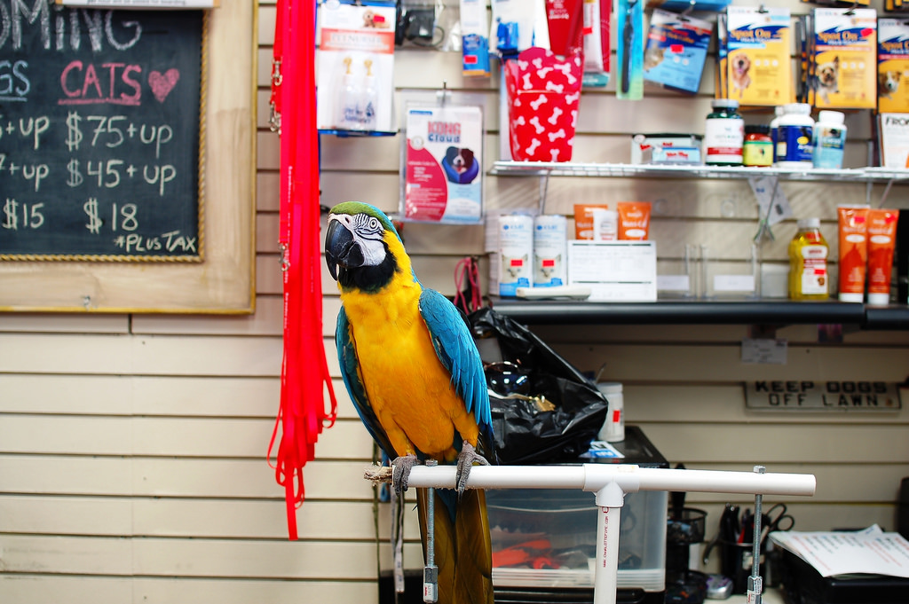

# Proud Pete's Pet Emporium 

In this tutorial you will add a slew of common patterns to an existing website for a pet store.

# Chapters

1. [Getting Started](P00-Getting-Started)
1. [Simple Search](P01-Simple-Search)
1. [Pagination](P02-Pagination)
1. [Validations and Success and Errors](P03-Validations-and-Success-and-Error-Handling)
1. [Upload Files](P04-Upload-Files)
1. [Payment Gateways](P05-Payment-Gateways)
1. [Send Emails](P06-Send-Emails)
1. [Full Text Search](P07-Full-Text-Search)
1. [Respond to JSON](P08-Responding-To-JSON)